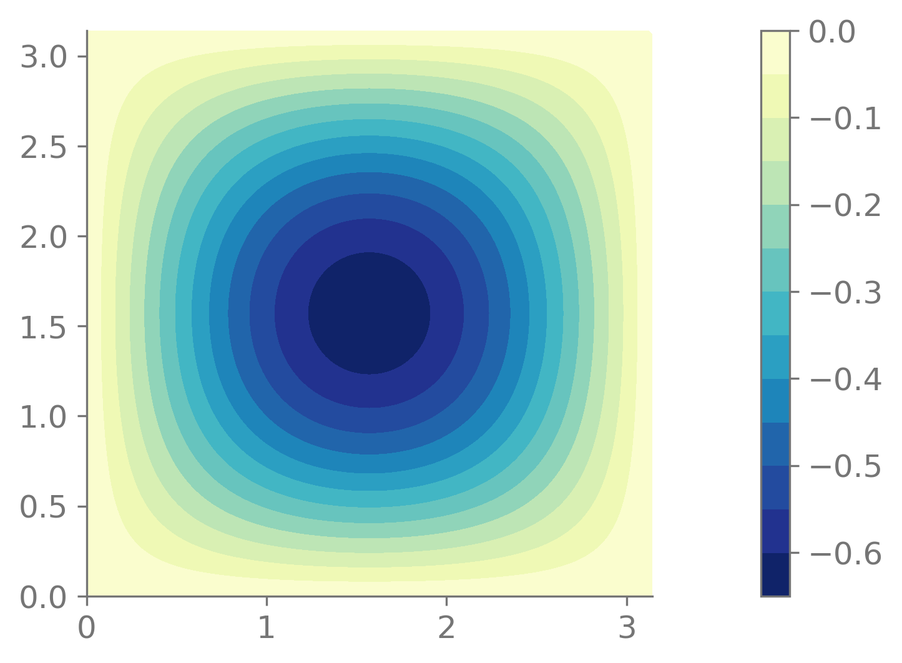

Creation of new elements
========================

SolidsPy supports user elements, that is, you can pass a function that
returns the mass and stiffness matrices for your element to the assembly
operator.

This example shows how to create an element for membrane deflection.

Equation to solve
-----------------

We want to find the vibration modes of vibration modes of a thin
membrane. This is described by the Helmholtz equation

.. math:: \nabla^2 u + k^2 u = 0\quad \forall \mathbf{x} \in \Omega\, .

The weak form for this problem is

.. math::

   \int_\Omega \nabla u \cdot \nabla u \mathrm{d}\Omega
   = k^2 \int_\Omega u^2 \mathrm{d}\Omega\, .

And the discretized system is given by

.. math:: [K]\{U\} = k^2[M]\{U\}\, .

The following snippets assume that the following imports are made.

.. code:: ipython3

    import numpy as np
    import matplotlib.pyplot as plt
    from scipy.sparse.linalg import eigsh
    import meshio
    import solidspy.assemutil as ass
    import solidspy.femutil as fem
    import solidspy.gaussutil as gau
    import solidspy.postprocesor as pos

Elemental matrices
------------------

We approximate the solution as

.. math:: u \approx \mathbf{N}^T \mathbf{u}\, ,

where :math:`\mathbf{N}^T = [N_0(x, y), N_1(x, y), \cdots, N_n(x, y)]`
is the matrix with interpolators,
:math:`\mathbf{u}^T = [u_0(x, y), u_1(x, y), \cdots, u_n(x, y)]` the
matrix with displacements, and :math:`n` is the number of nodes in each
element.

The local mass and stiffness matrices are given by

.. math::

    \begin{align}
    &[M_e] = \int_{\Omega_e} \mathbf{N} \mathbf{N}^T \mathrm{d}x \mathrm{d}y\, ,\\
    &[K_e] = \int_{\Omega_e} \mathbf{B} \mathbf{B}^T \mathrm{d}x \mathrm{d}y\, ,
    \end{align}

:math:`\mathbf{B}` is the matrix with the gradient of function at each
node.

The function ``acoust_diff`` returns the interpolation matrix
:math:`\mathbf{N}`, the interpolation derivatives matrix
:math:`\mathbf{B}`, and determinant for an element evaluated at a point
in local coordinates :math:`(r, s)`.

.. code:: ipython3

    def acoust_diff(r, s, coord, element):
        """
        Interpolation matrices for elements for acoustics
    
        Parameters
        ----------
        r : float
            Horizontal coordinate of the evaluation point.
        s : float
            Vertical coordinate of the evaluation point.
        coord : ndarray (float)
            Coordinates of the element.
    
        Returns
        -------
        H : ndarray (float)
            Array with the shape functions evaluated at the point (r, s)
            for each degree of freedom.
        B : ndarray (float)
            Array with the gradient matrix evaluated
            at the point (r, s).
        det : float
            Determinant of the Jacobian.
        """
        N, dNdr = element(r, s)
        N.shape = 1, N.shape[0]
        det, jaco_inv = fem.jacoper(dNdr, coord)
        dNdx = jaco_inv @ dNdr
        return N, dNdx, det

Using the function ``acoust_diff`` we could compute local mass and
stiffness matrices. The function ``acoust_tri6`` returns these local
matrices for a quadratic triangular element (6 nodes). As input
arguments is take the coordinates of the nodes and material parameters,
speed of the wave in this case.

.. code:: ipython3

    def acoust_tri6(coord, params):
        """
        Triangular element with 6 nodes for acoustics under
        axisymmetric conditions.
    
        Parameters
        ----------
        coord : coord
            Coordinates of the element.
        params : list
            List with material parameters in the following order:
            [Speed].
    
        Returns
        -------
        stiff_mat : ndarray (float)
            Local stifness matrix.
        mass_mat : ndarray (float)
            Local mass matrix.
        """
        
        speed = params
        stiff_mat = np.zeros((6, 6))
        mass_mat = np.zeros((6, 6))
        gpts, gwts = gau.gauss_tri(order=3)
        for cont in range(gpts.shape[0]):
            r = gpts[cont, 0]
            s = gpts[cont, 1]
            H, B, det = acoust_diff(r, s, coord, fem.shape_tri6)
            factor = det * gwts[cont]
            stiff_mat += 0.5 * speed**2 * factor * (B.T @ B)
            mass_mat += 0.5 * factor * (H.T @ H)
        return stiff_mat, mass_mat

Assembly of system of equations
-------------------------------

We need to read the mesh that is in the file ``square.msh``.

.. code:: ipython3

    mesh = meshio.read("square.msh")
    points = mesh.points
    cells = mesh.cells
    tri6 = cells["triangle6"]
    line3 = cells["line3"]
    npts = points.shape[0]
    nels = tri6.shape[0]

We define the nodes array.

.. code:: ipython3

    nodes = np.zeros((npts, 3))
    nodes[:, 1:] = points[:, 0:2] 

And the constraints array.

.. code:: ipython3

    line_nodes = list(set(line3.flatten()))
    cons = np.zeros((npts, 1), dtype=int)
    cons[line_nodes, :] = -1

For the elements array we don’t need to use the first three columns
since we are going to tell the assembly function to use our own function
to compute the matrices.

.. code:: ipython3

    elements = np.zeros((nels, 9), dtype=int)
    elements[:, 1] = 2
    elements[:, 3:] = tri6

.. code:: ipython3

    mats = np.array([[1.0]])

.. code:: ipython3

    assem_op, bc_array, neq = ass.DME(cons, elements,
                                      ndof_node=1, ndof_el_max=6)

.. code:: ipython3

    stiff_mat, mass_mat = ass.assembler(elements, mats, nodes, neq,
                                        assem_op, uel=acoust_tri6)

Solution of the eigenvalue problem
----------------------------------

.. code:: ipython3

    eigvals, eigvecs = eigsh(stiff_mat, M=mass_mat, k=10, which="LM",
                             sigma=1e-6)
    eigvals

.. code::

    array([ 2.00000007,  5.00000066,  5.0000012 ,  8.0000045 , 10.00000638,
           10.00000638, 13.00001214, 13.00002403, 17.00002827, 17.00002928])

This problem has as analytical solution

.. math:: k^2 = m^2 + n^2\quad \forall m, n\in \mathbb{N}\, .

.. code:: ipython3

    eigvals_exact = np.array(sorted([m**2 + n**2
                                     for m in range(1, 10)
                                     for n in range(1, 10)])[:10])
    eigvals_exact

.. code::

    array([ 2,  5,  5,  8, 10, 10, 13, 13, 17, 17])

We can compare them in a plot.

.. code:: ipython3

    plt.plot(eigvals_exact, "ko")
    plt.plot(eigvals, "r.")
    plt.xlabel("Eigenvalue number")
    plt.ylabel("Eigenvale")

.. figure:: img/membrane_eigs.png
   :alt: Analytic vs. numerical results.
   :width: 800 px

Visualization
-------------

Let us visualize the first vibration mode. For that we first need to
complete the solution vector with ``pos.complete_disp`` and then
``pos.plot_node_field``.

.. code:: ipython3

    sol = pos.complete_disp(bc_array, nodes, eigvecs[:, 0], ndof_node=1)

.. code:: ipython3

    pos.plot_node_field(sol[:, 0], nodes, elements)

Finally, we can complete all the eigenvectors and export the results to
a VTK file.

.. code:: ipython3

    for cont in range(10):
        aux = pos.complete_disp(bc_array, nodes, eigvecs[:, cont],
                          ndof_node=1)
        mesh.point_data["mode_%d" % cont] = aux
    
    meshio.write("membrane.vtk", mesh)

