==========================================================================
Geometry in Gmsh and solution with SolidsPy
==========================================================================

:Author: Nicolás Guarín-Zapata
:Date: September, 2018

This document is a tutorial on how to generate a (specific) geometry
using Gmsh [Gmsh2009]_ and its subsequent processing for the generation
of input files for a Finite Element program in Python. This document
does not pretend to be an introduction to the management of Gmsh,
for this we suggest the official tutorial [Gmsh_tut]_
(for text mode) or the official screencasts [Gmsh_scr]_
(for the graphical interface).

Model
=====

The example to be solved corresponds to the determination of
Efforts in a cylinder in the *Brazilian Test*. The Brazilian Test
is a technique that is used for the indirect measurement of the resistance of
rocks It is a simple and effective technique, and therefore it is commonly used
for rock measurements. Sometimes this test is also used
for concrete [D3967-16]_.

The following figure presents a scheme of the model to solve. Since the
original model may present rigid body movements, it
decides to use the symmetry of the problem. Then, the problem to
solve is a quarter of the original problem and the surfaces lower e
left present restrictions of *roller*.

   Schematic of the problem to be solved.

Creation of the geometry and mesh in Gmsh
=========================================

As a first step, it is suggested to create a new file in Gmsh, as
It shows in the following figure.

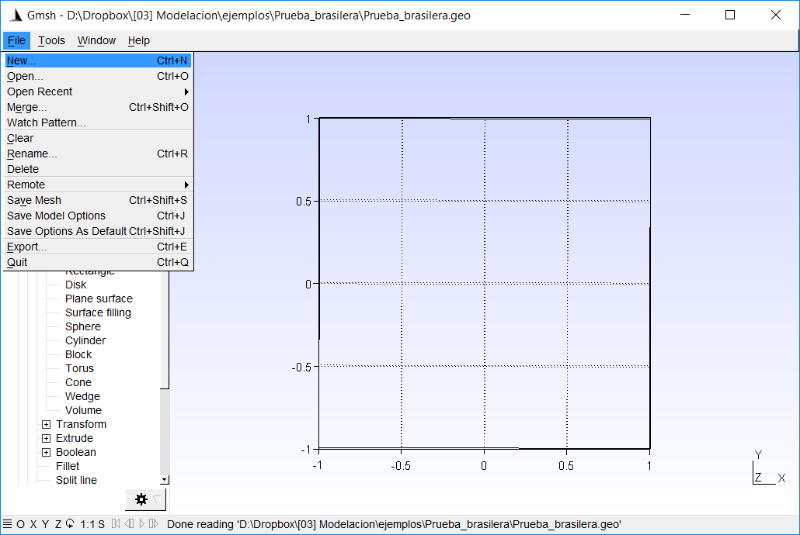

   Creation of a new file in Gmsh.

When creating a new document it is possible [1]_ for Gmsh to ask about which
geometry kernel to use. We will not dwell on what the differences are
and we will use ``built-in``.

   Pop-up window asking for the geometry kernel.

To create a model, we initially create the points. For that, let's go
to the option: ``Geometry> Elementary Entities> Add> Point``, as
shown in the following figure. Then, the coordinates of the
points in the pop-up window and "Add". Finally we can close the
pop-up window and press ``e``.

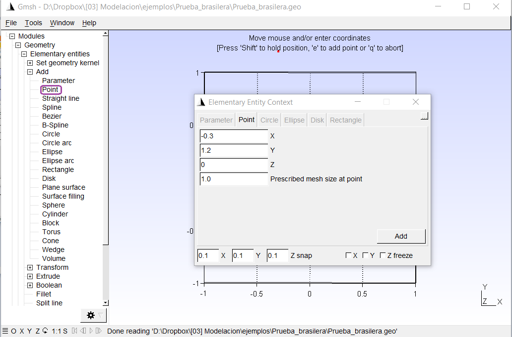

   Agregar puntos al modelo.

Later we create lines. For this, we go to the option:
`` Geometry> Elementary Entities> Add> Straight line``, as
shown in the following figure, and we select the initial points and
endings for each line. At the end, we can press ``e``.

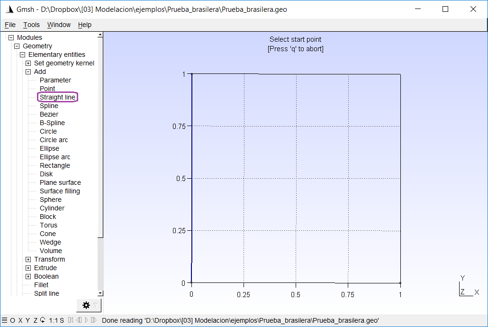

   Add straight lines to the model.

We also create the circle arcs. For this, we go to the
option: ``Geometry> Elementary Entities> Add> Circle Arc``, as
shown in the following figure, and we select the initial points,
central and final for each arc (in that order). At the end, we can
press ``e``.

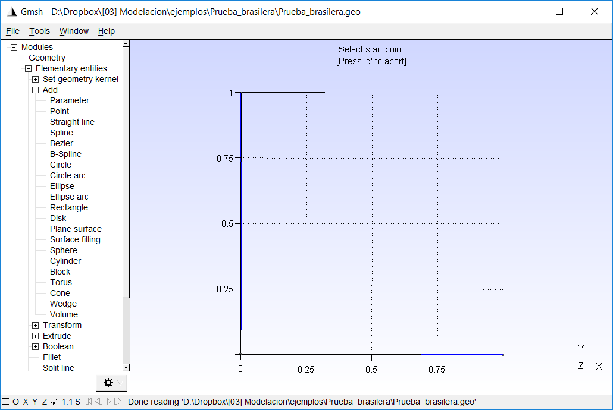

   Add arcs to the model.

Since we already have a closed contour, we can define a surface.
For this, we go to the option:
``Geometry> Elementary Entities> Add> Plane Surface``, as
shown in the following figure, and we select the contours in order.
At the end, we can press `` e``.

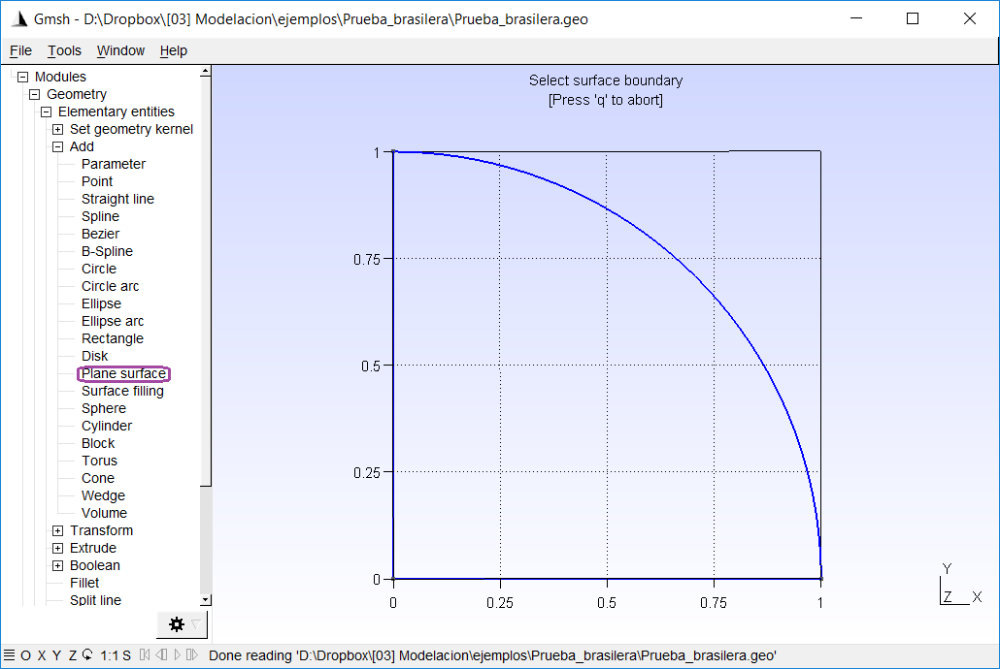

   Add surfaces.

Now, we need to define *physical groups*. Physical groups allow us to
associate names to different parts of the model such as lines and
surfaces. This will allow us to define the region in which we will resolve
the model (and we will associate a material), the regions that have
restricted movements (boundary conditions) and the regions
on which we will apply the load. In our case we will have 4 groups
physical:

- Region of the model, where we will define a material;

- Bottom edge, where we will restrict the displacement in :math:`y`;

- Left edge, where we will restrict the displacement in :math:`x`; and

- Top point, where we will apply the point load.

To define the physical groups we are going to
``Geometry> Physical groups> Add> Plane Surface``, as shown in the
next figure. In this case, we can leave the field of `` Name`` empty
and allow Gmsh to name the groups for us, which will be
numbers that we can then consult in the text file

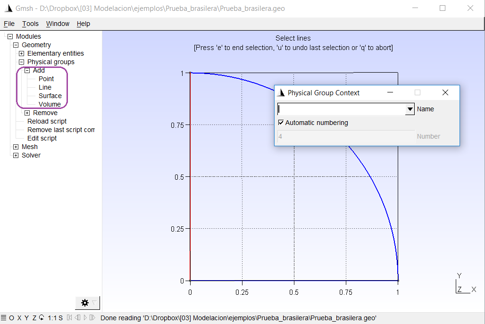

   Add physical groups.

After (slightly) editing the text file (``.geo``) this looks like this

.. code:: C

  L = 0.1;

  // Points
  Point(1) = {0, 0, 0, L};
  Point(2) = {1, 0, 0, L};
  Point(3) = {0, 1, 0, L};

  // Lines
  Line(1) = {3, 1};
  Line(2) = {1, 2};
  Circle(3) = {2, 1, 3};

  // Surfaces
  Line Loop(1) = {2, 3, 1};
  Plane Surface(1) = {1};

  // Physical groups
  Physical Line(1) = {1};
  Physical Line(2) = {2};
  Physical Point(3) = {3};
  Physical Surface(4) = {1};

We added a parameter ``L``, which we can vary to
to change the size of the elements when creating the
mesh.

Now, we proceed to create the mesh. To do this, we go to ``Mesh> 2D``.
As we see in the figure below.

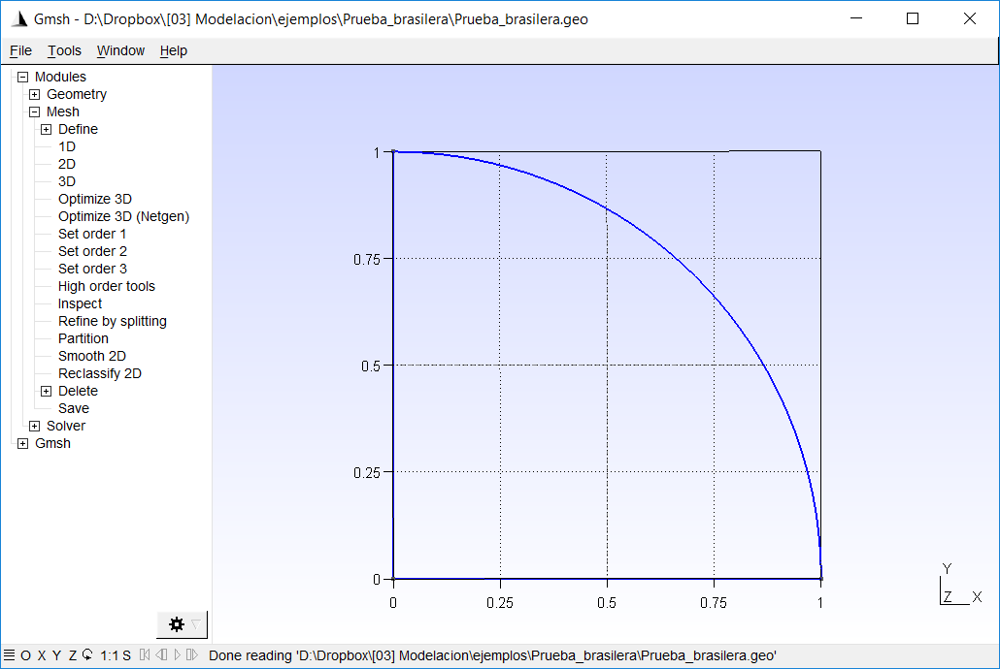

   Create the mesh.

Additionally, we can change the configuration so that it shows the elements
of the mesh in colors. For this, we are going to
``Tools> Options> Mesh`` and mark the box that indicates
``Surface faces``.

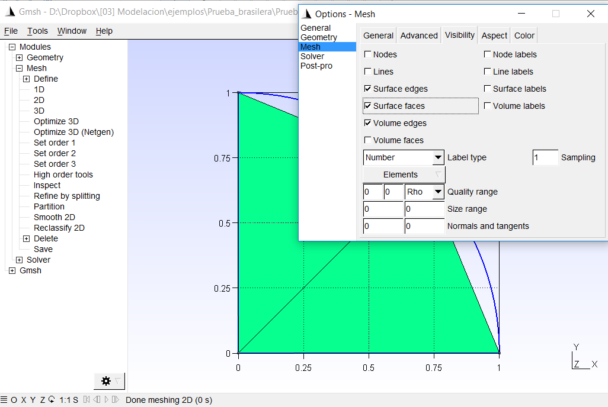

   Create the mesh.

We can then refine the mesh going to
``Mesh> Refine by Splitting``, or by modifying the ``L`` parameter in the
input file (.geo). As a last step, we want to save the mesh.
To do this, go to ``Mesh> Save``, or ``File> Save Mesh``, as
shows below.

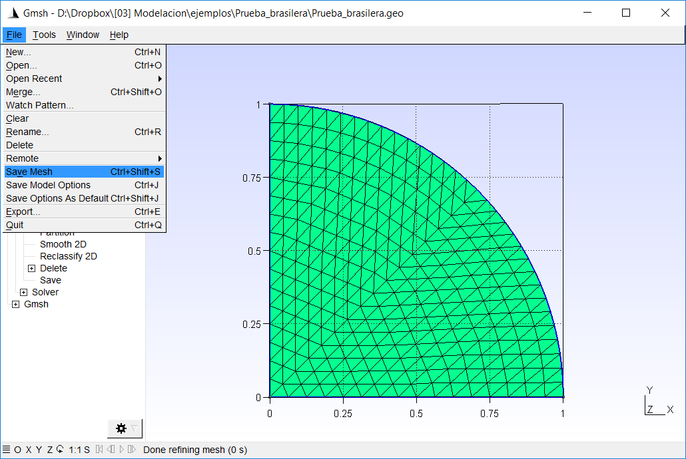

   Save the ``.msh`` file.

Python script to generate input files
=====================================

We need to create files with the information of the nodes (``nodes.txt``),
elements (``eles.txt``), loads (``loads.txt``) and materials
(``mater.txt``).

The following code generates the necessary input files for
Run the finite element program in Python.

.. code-block:: python

  import meshio
  import numpy as np

  mesh = meshio.read("Prueba_brasilera.msh")
  points = mesh.points
  cells = mesh.cells
  point_data = mesh.point_data
  cell_data = mesh.cell_data

  # Element data
  eles = cells["triangle"]
  els_array = np.zeros([eles.shape[0], 6], dtype=int)
  els_array[:, 0] = range(eles.shape[0])
  els_array[:, 1] = 3
  els_array[:, 3::] = eles

  # Nodes
  nodes_array = np.zeros([points.shape[0], 5])
  nodes_array[:, 0] = range(points.shape[0])
  nodes_array[:, 1:3] = points[:, :2]

  # Boundaries
  lines = cells["line"]
  bounds = cell_data["line"]["gmsh:physical"]
  nbounds = len(bounds)

  # Loads
  id_cargas = cells["vertex"]
  nloads = len(id_cargas)
  load = -10e8 # N/m
  loads_array = np.zeros((nloads, 3))
  loads_array[:, 0] = id_cargas
  loads_array[:, 1] = 0
  loads_array[:, 2] = load

  # Boundary conditions
  id_izq = [cont for cont in range(nbounds) if bounds[cont] == 1]
  id_inf = [cont for cont in range(nbounds) if bounds[cont] == 2]
  nodes_izq = lines[id_izq]
  nodes_izq = nodes_izq.flatten()
  nodes_inf = lines[id_inf]
  nodes_inf = nodes_inf.flatten()
  nodes_array[nodes_izq, 3] = -1
  nodes_array[nodes_inf, 4] = -1

  #  Materials
  mater_array = np.array([[70e9, 0.35],
                          [70e9, 0.35]])
  maters = cell_data["triangle"]["gmsh:physical"]
  els_array[:, 2]  = [1 for mater in maters if mater == 4]

  # Create files
  np.savetxt("eles.txt", els_array, fmt="%d")
  np.savetxt("nodes.txt", nodes_array,
             fmt=("%d", "%.4f", "%.4f", "%d", "%d"))
  np.savetxt("loads.txt", loads_array, fmt=("%d", "%.6f", "%.6f"))
  np.savetxt("mater.txt", mater_array, fmt="%.6f")

Now, let's discuss the different parts of the code to see what it does
each.

Header and reading the ``.msh`` file
------------------------------------

The first part loads the necessary Python modules and reads the file
of mesh that in this case is called ``Prueba_brasilera.msh`` (line 6 and
7). In order for Python to be able to read the file, it must be in the
same directory as the Python file that will process it.

.. code:: python

  import meshio
  import numpy as np

  mesh = meshio.read("Prueba_brasilera.msh")
  points = mesh.points
  cells = mesh.cells
  point_data = mesh.point_data
  cell_data = mesh.cell_data

Element data
------------

The next section of the code creates the data for elements. The line
18 creates a variable `` eles`` with the information of the nodes that
make up each triangle. Line 11 creates an array (filled with zeros)
with the number of rows equal to the number of elements
(``eles.shape[0]``) and 6 columns [2]_. Then we assign a number to
each element, what we do on line 12 with ``range(eles.shape[0])``
and this we assign to column 0. All
elements are triangles, that's why we should put 3 in column 1. Last,
in this section, we assign the nodes of each element to the array
with (line 19), and this assignment is made from column 3 to
final with ``els_array[:, 3::]``.

.. code:: python

  # Element data
  eles = cells["triangle"]
  els_array = np.zeros([eles.shape[0], 6], dtype=int)
  els_array[:, 0] = range(eles.shape[0])
  els_array[:, 1] = 3
  els_array[:, 3::] = eles

Nodes data
----------

In the next section we create the information related to the
nodes. To do this, on line 17 we created an array ``nodes_array``
with 5 columns and as many rows as there are points in the model
(``points.shape[0]``). Then, we assign the
element type on line 18. And finally, we assign the
information on the coordinates of the nodes on line 19 with
``nodes_array[:, 1:3] = points[:, :2]``, where we are adding the
information in columns 1 and 2.

.. code:: python

  # Nodes
  nodes_array = np.zeros([points.shape[0], 5])
  nodes_array[:, 0] = range(points.shape[0])
  nodes_array[:, 1:3] = points[:, :2]

Boundary data
-------------

In the next section we find the line information. For this,
we read the ``cells`` information in position ``line`` [3]_
(line 22). The array ``lines``
will then have the information of the nodes that form each
line that is on the border of the model. Then, we read the information
of the physical lines (line 23), and we calculate how many lines belong
to the physical lines (line 24).

.. code:: python

  # Boundaries
  lines = cells["line"]
  bounds = cell_data["line"]["gmsh:physical"]
  nbounds = len(bounds)

Load data
---------

In the next section we must define the information of loads.
In this case, the loads are assigned in a single point that we define as a
physical group. On line 27 we read the nodes (in this case, one).
Then, we create an array that has as many rows as loads (``nloads``) and 3
columns Assign the number of the node to which each load belongs
(line 31), the charges in :math: `x` (line 32) and the loads in :math:`y` and
(line 33)

.. code:: python

  # Loads
  id_cargas = cells["vertex"]
  nloads = len(id_cargas)
  load = -10e8 # N/m
  loads_array = np.zeros((nloads, 3))
  loads_array[:, 0] = id_cargas
  loads_array[:, 1] = 0
  loads_array[:, 2] = load

Boundary conditions
-------------------

Now, we will proceed to apply the boundary conditions, that is, the
model regions that have restrictions on displacements.
Initially, we identify which lines have an identifier 1
(which would be the left side) with

.. code:: python

  id_izq = [cont for cont in range(nbounds) if bounds[cont] == 1]

This creates a list with the numbers (``cont``) for which the
condition (``bounds[cont] == 1``). On line 46 we get the nodes that belong to
these lines, however, this array has as many rows as lines
on the left side and two columns. First we return this array as
a one-dimensional array with ``nodes_izq.flatten()``. Later, on line 42,
we assign the value of -1 in the third column of the array for
nodes that belong to the left side. In the same way, this process
is repeated for the nodes at the bottom line.

.. code:: python

  # Boundary conditions
  id_izq = [cont for cont in range(nbounds) if bounds[cont] == 1]
  id_inf = [cont for cont in range(nbounds) if bounds[cont] == 2]
  nodes_izq = lines[id_izq]
  nodes_izq = nodes_izq.flatten()
  nodes_inf = lines[id_inf]
  nodes_inf = nodes_inf.flatten()
  nodes_array[nodes_izq, 3] = -1
  nodes_array[nodes_inf, 4] = -1

Materials
---------

In the next section we assign the corresponding materials to each
element. In this case, we only have one material. However, it
present the example as if there were two different ones. First, we created a
array with the material information where the first column
represents the Young's module and the second the Poisson's relation (line
46). Then, we read the information of the physical groups of surfaces
on line 48. Finally, we assign the value of 0 to the materials that
have as physical group 4 (see file ``.geo`` above) and 1 to the
others, which in this case will be zero (line 49). This information goes in the
column 2 of the arrangement.

.. code:: python

  #  Materials
  mater_array = np.array([[70e9, 0.35],
                          [70e9, 0.35]])
  maters = cell_data["triangle"]["gmsh:physical"]
  els_array[:, 2]  = [1 for mater in maters if mater == 4]

Export files
------------

The last section uses the ``numpy`` function to export the
files.

.. code:: python

  # Create files
  np.savetxt("eles.txt", els_array, fmt="%d")
  np.savetxt("nodes.txt", nodes_array,
           fmt=("%d", "%.4f", "%.4f", "%d", "%d"))
  np.savetxt("loads.txt", loads_array, fmt=("%d", "%.6f", "%.6f"))
  np.savetxt("mater.txt", mater_array, fmt="%.6f")

Solution using SolidsPy
=======================

To solve the model, we can type [4]_

.. code:: python

  from solidspy import solids_GUI
  disp = solids_GUI()

After running this program it will appear
a pop-up window as shown below. In this window
the directory we should locate the folder with the input files
generated previously. Keep in mind that the appearance of
this window may vary between operating systems. Also, we have
notef that sometimes the pop-up window may be hidden
by other windows on your desktop.

   Pop-up window to locate folder with input files.

At this point, the program must solve the model. If the
input files are used without modifications the program should print
a message similar to the following.

::

    Number of nodes: 123
    Number of elements: 208
    Number of equations: 224
    Duration for system solution: 0:00:00.086983
    Duration for post processing: 0:00:00
    Analysis terminated successfully!

the times taken to solve the system can change a bit
from one computer to another.

As a last step, the program generates graphics with the fields of
displacements, deformations and stresses, as shown in the
next figures.

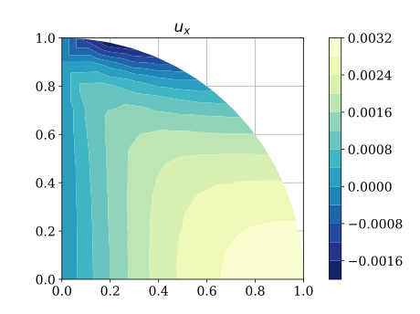

   Horizontal displacement.

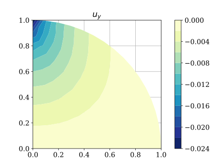

   Vertical displacement.

References
==========

.. [D3967-16]
   ASTM D3967–16 (2016), Standard Test Method for Splitting Tensile
   Strength of Intact Rock Core Specimens, ASTM
   International, `www.astm.org <www.astm.org>`__.

.. [Gmsh2009]
   Geuzaine, Christophe, y Jean-François Remacle (2009), *Gmsh: A 3-D
   finite element mesh generator with built-in pre-and post-processing
   facilities*. International Journal for Numerical Methods in Engineering,
   79.11.

.. [Gmsh_tut]
   Geuzaine, Christophe, y Jean-François Remacle (2017), Gmsh Official
   Tutorial. Accessed: April 18, 2018
   http://gmsh.info/doc/texinfo/gmsh.html#Tutorial.

.. [Gmsh_scr]
   Geuzaine, Christophe, y Jean-François Remacle (2017), Gmsh Official
   Screencasts. Accessed: April 18, 2018de
   http://gmsh.info/screencasts/.

.. [1]
   If the version is 3.0 or higher, this pop-up window will appear.

.. [2]
   For quadrilateral elements, 7 columns would be used, since each
   Element is defined by 4 nodes.

.. [3]
   ``cells`` is a dictionary and allows to store information associated
   with some keywords, in this case it is ``lines``.

.. [4]
   To make use of the graphical interface it must be installed
   ``easygui``.
