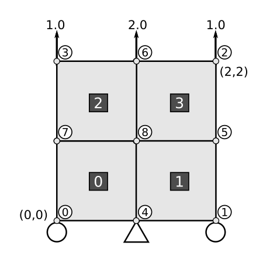
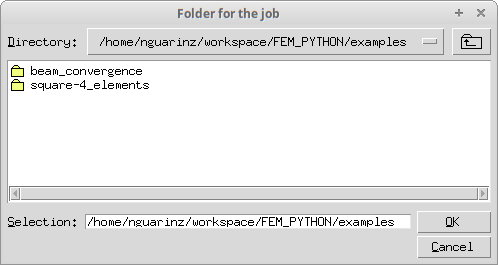
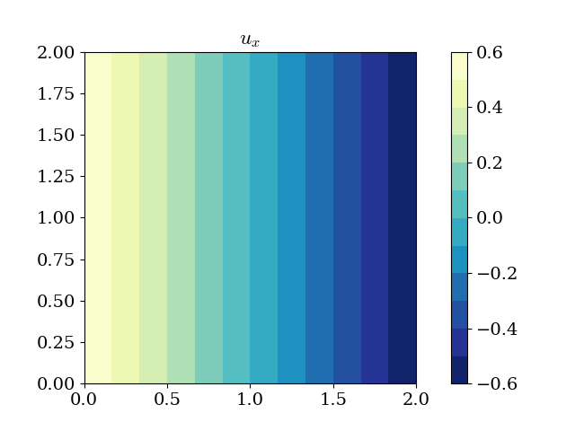
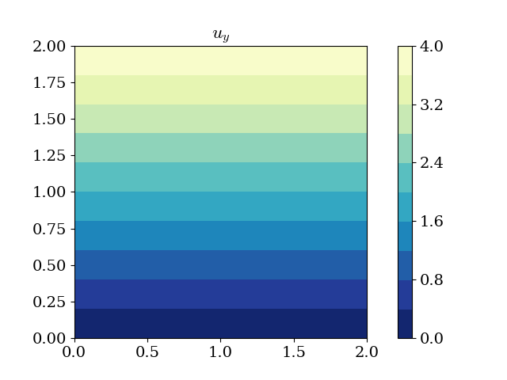

Start here: 2×2 square with axial load
======================================

:Author: Nicolás Guarín-Zapata
:Date: May, 2017

In this document we briefly describe the use of SolidsPy, through a
simple example corresponding to a square plate under point loads.

Input files
-----------

The code requires the domain to be input in the form of text files
containing the nodes, elements, loads and material information. These
files must reside in the same directory and must have the names
``eles.txt``, ``nodes.txt``, ``mater.txt`` and ``loads.txt``. Assume
that we want to find the response of the 2×2 square under unitary
vertical point loads shown in the following figure. Where one corner is
located at (0,0) and the opposite one at (2,2).

   4-element solid under point loads.

The file ``nodes.txt`` is composed of the following fields:

-  Column 0: Nodal identifier (integer).
-  Column 1: x-coordinate (float).
-  Column 2: y-coordinate (float).
-  Column 3: Boundary condition flag along the x-direction (0 free, -1
   restrained).
-  Column 4: Boundary condition flag along the y-direction (0 free, -1
   restrained).

The corresponding file has the following data

::

    0  0.00  0.00   0  -1
    1  2.00  0.00   0  -1
    2  2.00  2.00   0   0
    3  0.00  2.00   0   0
    4  1.00  0.00  -1  -1
    5  2.00  1.00   0   0
    6  1.00  2.00   0   0
    7  0.00  1.00   0   0
    8  1.00  1.00   0   0

The file ``eles.txt`` contain the element information. Each line in the
file defines the information for a single element and is composed of the
following fields:

-  Column 0: Element identifier (integer).
-  Column 1: Element type (integer):

   - 1 for a 4-noded quadrilateral.
   - 2 for a 6-noded triangle.
   - 3 for a 3-noded triangle.

-  Column 2: Material profile for the current element (integer).
-  Column 3 to end: Element connectivity, this is a list of the nodes
   conforming each element. The nodes should be listed in
   counterclockwise orientation.

The corresponding file has the following data

::

    0   1   0   0   4   8   7
    1   1   0   4   1   5   8
    2   1   0   7   8   6   3
    3   1   0   8   5   2   6

The file ``mater.txt`` contain the material information. Each line in
the file corresponds to a material profile to be assigned to the
different elements in the elements file. In this example, there is one
material profile. Each line in the file is composed of the following
fields:

-  Column 0: Young's modulus for the current profile (float).
-  Column 1: Poisson's ratio for the current profile (float).

The corresponding file has the following data

::

    1.0  0.3

The file ``loads.txt`` contains the point loads information. Each line
in the file defines the load information for a single node and is
composed of the following fields

-  Column 0: Nodal identifier (integer).
-  Column 1: Load magnitude for the current node along the x-direction
   (float).
-  Column 2: Load magnitude for the current node along the y-direction
   (float).

The corresponding file has the following data

::

    3  0.0  1.0
    6  0.0  2.0
    2  0.0  1.0

Executing the program
---------------------

After installing the package, you can run the program in a Python
terminal using

::

    >>> from solidspy import solids_GUI
    >>> solids_GUI()

In Linux and you can also run the program from the terminal using

::

    $ python -m solidspy

If you have ``easygui`` installed a pop-up window will appear for you to
select the folder with the input files

   Folder selection window.

select the folder and click ok.

If you don't have ``easygui`` installed the software will ask you for
the path to your folder. The path can be absolute or relative.

::

    Enter folder (empty for the current one):

Then, you will see some information regarding your analysis

::

    Number of nodes: 9
    Number of elements: 4
    Number of equations: 14
    Duration for system solution: 0:00:00.006895
    Duration for post processing: 0:00:01.466066
    Analysis terminated successfully!

And, once the solution is achieved you will see displacements and stress
solutions as contour plots, like the following

Interactive execution
~~~~~~~~~~~~~~~~~~~~~

You can also run the program interactively using a Python terminal, a
good option is `IPython <http://ipython.org/>`__.

In IPython you can run the program with

.. code:: python

    In [1]: from solidspy import solids_GUI

    In [2]: UC = solids_GUI()

After running the code we have the nodal variables for post-processing.
For example, we can print the displacement vector

.. code:: python

    In [3]: np.set_printoptions(threshold=np.nan)

    In [4]: print(np.round(UC, 3))
    [ 0.6 -0.6 -0.6  4.   0.6  4.  -0.6  2.  -0.   4.   0.6  2.  -0.   2. ]

where we first setup the printing option for IPython to show the full
array and then rounded the array to 3 decimal places.

.. code:: python

    In [5]: U_mag = np.sqrt(UC[0::2]**2 + UG[1::2]**2)

    In [6]: print(np.round(U_mag, 3))
    [ 0.849  4.045  4.045  2.088  4.     2.088  2.   ]
