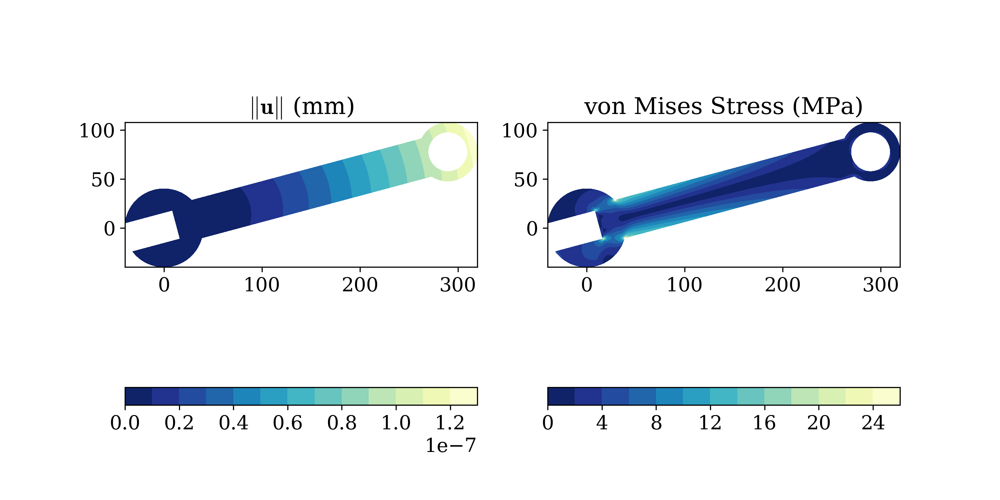

# Summary

JOSS welcomes submissions from broadly diverse research areas. For this reason, we request that authors include in the paper some sentences that would explain the software functionality and domain of use to a non-specialist reader. Your submission should probably be somewhere between 250-1000 words.

   A list of the authors of the software and their affiliations
   A summary describing the high-level functionality and purpose of the software for a diverse, non-specialist audience
   A clear statement of need that illustrates the purpose of the software
   A list of key references including a link to the software archive
   Mentions (if applicable) of any ongoing research projects using the software or recent scholarly publications enabled by it

The Finite Element Method is a numerical method for the solution of  problems in engineering and physics [@bathe]. These problems are commonly written as boundary value problems and involve partial differential equations.

``SolidsPy`` is a simple finite element analysis code for 2D elasticity problems and was designed to be used by researchers in computational mechanics and by
students in courses on Computational modeling. It has also been used in graduate
courses on Introduction to the Finite Element Method. It uses as input simple-to-create text files defining a model in terms of nodal, element, material and load data. Some feature of ``SolidsPy`` are:
- It is based on an open-source environment.
- It is easy to use.
- The code allows to find displacement, strain and stress solutions for arbitrary two-dimensional domains discretized into finite elements and subject to point loads.
- The code is organized in independent modules for pre-processing, assembly and post-processing allowing the user to easily modify it or add features like new elements or analyses pipelines.

``SolidsPy`` uses SciPy [@scipy] for matrix (sparse/dense) storage and solution of systems of equations. For the creation of complex meshes it is suggested to utilize ``Gmsh`` [@gmsh] and then take advantage of ``meshio`` [@meshio] as interface to Gmsh.

# Acknowledgements

We acknowledge contributions from Edward Villegas.

# References
